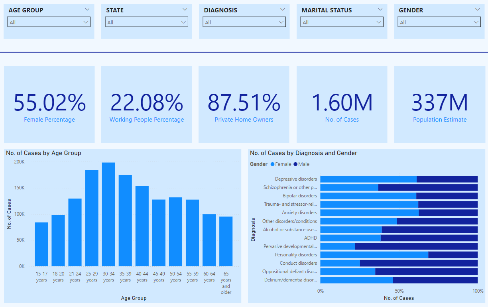
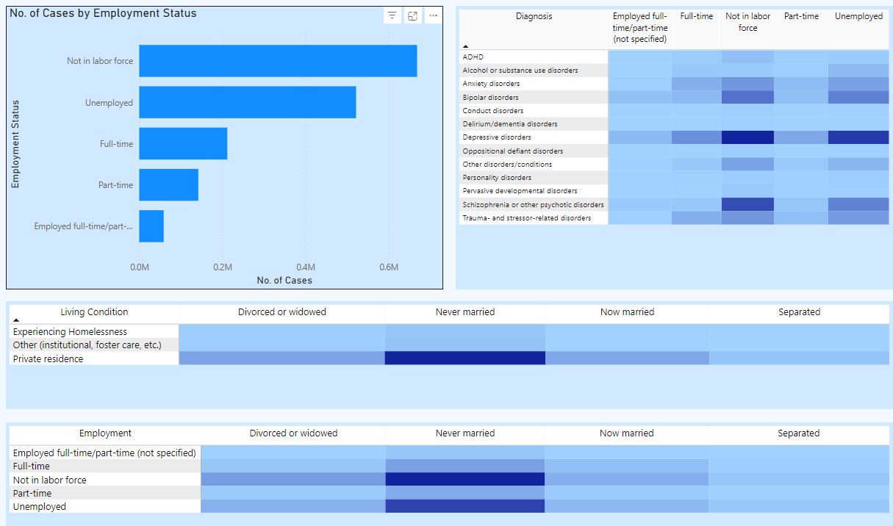
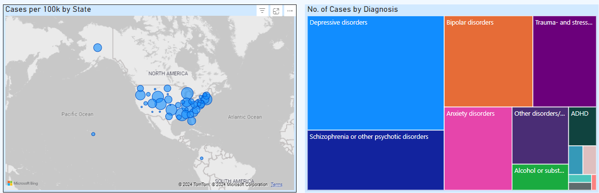

# Mental-Health-Analysis
An interactive Mental Health Dashboard visualizing demographic, diagnostic, and employment data from the 2022 Mental Health Client-Level Data (MH-CLD). This dashboard provides insights into mental health service utilization, population distribution, and diagnosis trends across different states and demographic groups.

The data is sourced from the Mental Health Client-Level Data (MH-CLD), 2022 provided by SAMHSA. 
Total Records: ~7 million

Key Variables:
 - Demographics (Age, Gender, Race, Ethnicity)  
 - Mental Health Diagnoses (Bipolar, Depression, ADHD, etc.)  
 - Employment Status  
- Residential Status  

## Dashboard Overview 

