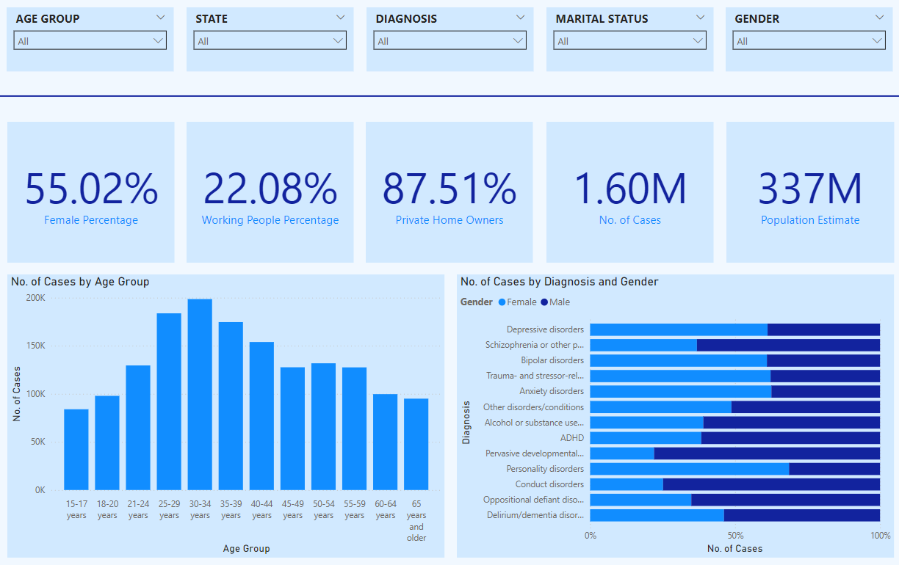
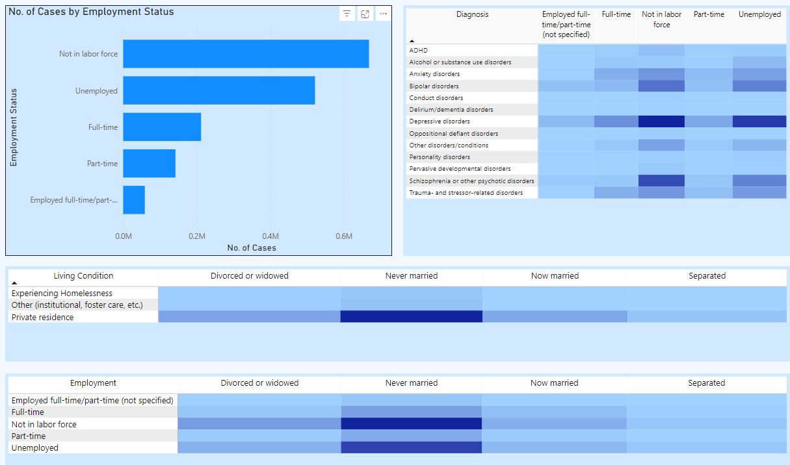
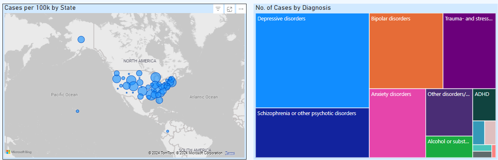

# Mental-Health-Analysis
An interactive Mental Health Dashboard visualizing demographic, diagnostic, and employment data from the 2022 Mental Health Client-Level Data (MH-CLD). This dashboard provides insights into mental health service utilization, population distribution, and diagnosis trends across different states and demographic groups.

The data is sourced from the Mental Health Client-Level Data (MH-CLD), 2022 provided by SAMHSA. 
Total Records: ~7 million

Key Variables:
 - Demographics (Age, Gender, Race, Ethnicity)  
 - Mental Health Diagnoses (Bipolar, Depression, ADHD, etc.)  
 - Employment Status  
- Residential Status  

## Dashboard Overview

## Mental Health Analysis – Dashboard Insights  

### Introduction  
Mental health is a growing concern in healthcare, with increasing cases demanding data-driven solutions. This dashboard provides a comprehensive look at mental health patterns across different demographics, diagnoses, and employment statuses. By analyzing this data, we uncover crucial insights into how mental health services are utilized and where potential gaps exist.  

---

### 1. Gender and Age Distribution  
The initial section of the dashboard reveals a **gender breakdown** where **55.02% of cases are female**. This indicates that women are more likely to engage with mental health services compared to men.  

The **age distribution** shows that the highest number of cases occur in the **30-34 age group**, followed closely by those aged **25-29**. This pattern suggests that early adulthood presents significant mental health challenges, likely linked to career pressures and life transitions.  

### Visualization:  
  
**Key Insights:**  
- Younger adults (25-34) are most affected.  
- Women seek mental health services more frequently than men.  

---

### 2. Diagnosis Trends  
Analysis of diagnosis data shows that **depressive disorders** are the most common condition, followed by **anxiety disorders, bipolar disorder, and schizophrenia**.  
Notably, there is a clear gender disparity in diagnoses:  
- Women experience **higher rates of depression and anxiety**.  
- Men are diagnosed more frequently with **schizophrenia and substance use disorders**.  

### Visualization:  
  
**Takeaways:**  
- Depression and anxiety are the leading mental health conditions.  
- Gender differences highlight the need for gender-specific mental health strategies.  

---

### 3. Employment and Mental Health  
Employment status plays a significant role in mental health. The data indicates that individuals **not in the labor force** or **unemployed** account for the majority of cases.  

In contrast, those in **full-time employment** show significantly lower rates of mental health service engagement.  

### Visualization:  
  
**Insights:**  
- Economic instability correlates strongly with poor mental health.  
- Unemployed populations require targeted mental health interventions.  

---

### 4. Living Conditions and Mental Health  
A breakdown by living conditions highlights that individuals experiencing **homelessness** or residing in **institutional care** have the highest rates of mental health cases.  
- Those living in **private residences** show significantly lower case numbers.  

**Implications:**  
- Stable housing directly impacts mental well-being.  
- Addressing housing insecurity can reduce mental health burdens.  

---

### 5. Geographical Distribution  
The **state-level map** visualization pinpoints regions with the highest cases per 100k population. Some states exhibit higher engagement with mental health services, indicating either increased need or better access.  

**Story Insight:**  
- High-case states may have stronger mental health infrastructure.  
- Lower-engagement states may benefit from expanded outreach and awareness initiatives.  

---

### Conclusion – The Path Forward  
This dashboard highlights the intricate relationship between mental health and factors such as gender, employment, and housing.  
**Key Focus Areas:**  
- Increase mental health awareness for **men** and **working adults**.  
- Implement housing and employment support initiatives to reduce mental health risks.  
- Develop mental health programs tailored to **young adults** transitioning into new life phases.  

By leveraging these insights, we can drive better policy decisions and create targeted interventions that enhance mental well-being for all populations.

## Contact  
For questions or collaboration:  
- **Email**: [saishanm.ssp@gmail.com](mailto:saishanm.ssp@gmail.com)  

